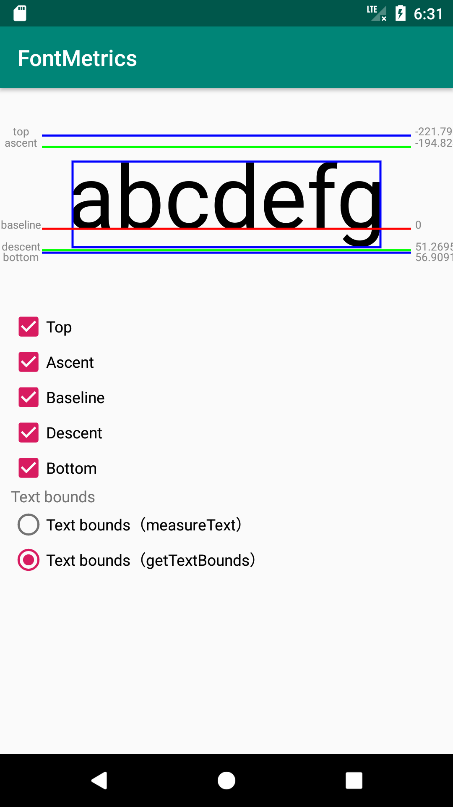

### 基本概念  

字符度量（FontMetrics）是指对于指定字号的某种字体，在度量方面的各种属性，其描述参数包括：

  - baseline：字符基线（值为 0）
  - ascent：字符最高点到 baseline 的推荐距离（值为负数）
  - descent：字符最低点到 baseline 的推荐距离（值为正数）
  - top：字符最高点到 baseline 的最大距离（值为负数）
  - bottom：字符最低点到 baseline 的最大距离（值为正数）
  - leading：行间距，即前一行的 descent 与下一行的 ascent 之间的距离，如果是单行，则为 0
  
### 例子  

这是一个 FontMetrics 的例子，描画了各种线来帮助直观的理解。  

  

其中包括  
  - top
  - bottom
  - ascent
  - descent
  - baseline
  - bounds（这个是文字的四周的边框）
通过点击复选框来显示/隐藏相应的线。  
线的左端用来显示 top、ascent、baseline 等文字。  
线的右端用来显示相对于 baseline 的 distance。Baseline 为 0，Baseline 上方的为负值，Baseline 下方的为正值。  

关于文字的长度，有两种方法取得。  

第一种，通过 getTextBounds  
```java
private val textBounds: Rect by lazy { Rect() }
textPaint.getTextBounds(text, 0, text.length, textBounds)
```

第二种，通过 measureText  
```java
private val textBounds: Rect by lazy { Rect() }
textPaint.measureText(text)
```

getTextBounds 计算的正好是文字的四周。  
measureText 计算的文字长度，比 getTextBounds 长一点，也就是文字左右两边有一点空隙。通过点击本例的 Text boundds 的单选框，可以直观的理解。  
getTextBounds 能计算文字四周，而 measureText 只能计算文字长度。  
